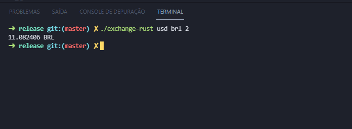

# Exchange Rust 🦀

<div align="center">



</div>

Uma CLI escrita em [Rust](https://www.rust-lang.org/pt-BR) que converte um valor de uma moeda para outra consumindo a API [CurrencyConverterApi](https://free.currencyconverterapi.com/) (projeto de estudo).

## Utilizando

<hr/>

Faça o [download da CLI](https://github.com/tuliocll/exchange-rust/releases).

Dê permissão para execução:

```sh
sudo chmod +x exchange-rust
```

Mova para a pasta `bin`:

```sh
mv exchange-rust /usr/local/bin
```

Execute:

```sh
exchange-rust [DE] [PARA] [VALOR]
```

Exemplo:

```sh
exchange-rust usd brl 2
```

## Libs utilizadas

<hr/>

- [openssl](https://docs.rs/openssl/0.10.38/openssl/)
- [reqwest](https://docs.rs/reqwest/0.11.6/reqwest/)
- [tokio](https://tokio.rs/)

<div align="center">

### Made with 💙 in Bahia, Brasil.

</div>
